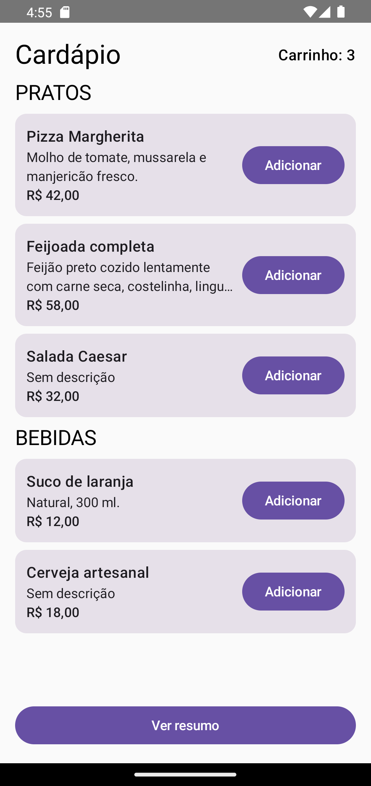
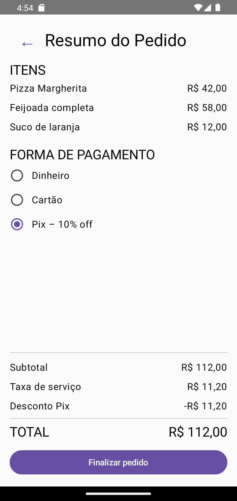
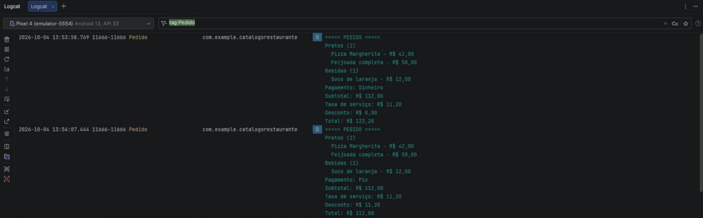

# Catálogo Interativo de Restaurante

PDM II · ATV1

App Android em Kotlin + Jetpack Compose (Material 3). Mostra um cardápio dividido em pratos e bebidas, deixa adicionar itens a um carrinho, calcula taxa de serviço e desconto conforme a forma de pagamento e fecha o pedido em uma tela de resumo no formato de recibo.

## Grupo

| Integrante | GitHub |
| --- | --- |
| Filipe Lima | [@1filipeolv](https://github.com/1filipeolv) |
| Yago Uran Kurashiki Rios | [@Yajoojj](https://github.com/Yajoojj) |
| Carlos Eduardo Campos Takeshita (Kadu) | [@carlostakeshita](https://github.com/carlostakeshita) |

## Divisão de responsabilidades

| Parte | Camada | Responsável | O que fez | Arquivos |
| --- | --- | --- | --- | --- |
| A | Modelagem de dados | Filipe | Hierarquia fechada de itens do menu (`ItemMenu` → `Prato`, `Bebida`), formas de pagamento como tipos restritos (`Dinheiro`, `Cartao`, `Pix` com percentual de desconto) e os dados do cardápio | `model/ItemMenu.kt`, `model/FormaPagamento.kt`, `model/CardapioData.kt` |
| B | Regras de negócio | Yago | Motor de cálculo isolado da interface (subtotal, taxa de serviço, desconto e total), agrupamento por categoria, relatório no Logcat, estado do carrinho e navegação entre as telas, teste unitário do cenário de validação | `domain/CalculadoraPedido.kt`, `MainActivity.kt`, `CalculadoraPedidoTest.kt` |
| C | UI Catálogo | Filipe | Tela principal com as seções PRATOS e BEBIDAS, card reutilizável com callback de adicionar, descrição truncada e texto substituto para descrição nula | `ui/CatalogoScreen.kt`, `ui/ItemCard.kt` |
| D | UI Resumo | Kadu | Tela de checkout em formato de recibo, linha reutilizável (nome + valor), seletor de forma de pagamento com RadioButton e recálculo imediato, botão de finalizar com confirmação, README e entrega | `ui/ResumoScreen.kt`, `ui/LinhaRecibo.kt`, `README.md` |

As tarefas de cada parte estão nas issues [#1](https://github.com/Yajoojj/catalogo-restaurante/issues/1), [#2](https://github.com/Yajoojj/catalogo-restaurante/issues/2) e [#3](https://github.com/Yajoojj/catalogo-restaurante/issues/3), e o histórico de commits mostra o que cada um subiu.

## Arquitetura

```
app/src/main/java/com/example/catalogorestaurante/
├── model/     dados: ItemMenu (sealed class), FormaPagamento (sealed interface), cardápio
├── domain/    CalculadoraPedido: todas as contas, sem Compose e sem Android
├── ui/        telas e componentes: só exibem o que recebem por parâmetro
└── MainActivity.kt   guarda o estado (carrinho, forma de pagamento, tela atual)
```

- **Estado em um lugar só.** O carrinho e a forma de pagamento ficam na `MainActivity`. As telas recebem os dados por parâmetro e avisam o que aconteceu por callback (`onAdicionar`, `onFormaPagamentoChange`, `onVoltar`), então nenhuma tela tem dado fixo dentro dela.
- **Conta fora da tela.** Subtotal, taxa, desconto e total vêm da `CalculadoraPedido`. Quando o usuário troca a forma de pagamento, o estado muda, a tela de resumo recompõe e pede os valores de novo, por isso o recálculo aparece na hora.
- **Hierarquias fechadas.** `ItemMenu` e `FormaPagamento` são `sealed`, então todo `when` é exaustivo: se entrar uma forma de pagamento nova, o código não compila até ela ser tratada no cálculo e na tela.
- **Tipografia e textos longos.** Só estilos de `MaterialTheme.typography`. Nome e descrição têm limite de linhas e são cortados com reticências; descrição nula vira "Sem descrição".

## Telas

| Catálogo | Resumo do pedido |
| --- | --- |
|  |  |

## Cenário de validação

Pizza Margherita (R$ 42,00) + Feijoada completa (R$ 58,00) + Suco de laranja (R$ 12,00), pagando no Pix:

| | Valor |
| --- | --- |
| Subtotal | R$ 112,00 |
| Taxa de serviço (10% do subtotal) | R$ 11,20 |
| Desconto Pix (10% do subtotal) | -R$ 11,20 |
| **Total** | **R$ 112,00** |

No Dinheiro ou no Cartão não há desconto e o total vai para R$ 123,20.

O mesmo cenário está coberto no teste `CalculadoraPedidoTest` (`./gradlew test`).

## Log de saída (Logcat)

Filtrar o Logcat pela tag `Pedido`. O relatório sai ao abrir o resumo e a cada troca da forma de pagamento. Saída para o cenário de validação no Pix:

```
===== PEDIDO =====
Pratos (2)
  Pizza Margherita - R$ 42,00
  Feijoada completa - R$ 58,00
Bebidas (1)
  Suco de laranja - R$ 12,00
Pagamento: Pix
Subtotal: R$ 112,00
Taxa de serviço: R$ 11,20
Desconto: R$ 11,20
Total: R$ 112,00
```

Print do Logcat com o mesmo pedido, primeiro no Dinheiro e depois no Pix:



## Vídeo de apresentação

Link: _a incluir após o envio para o YouTube (não listado)_

## Como rodar

1. Clonar o repositório e abrir no Android Studio.
2. Esperar o Gradle sincronizar e rodar o módulo `app` em um emulador ou aparelho (Android 7.0 / API 24 ou mais novo).
3. Adicionar os itens no catálogo, tocar em "Ver resumo" e escolher a forma de pagamento.
